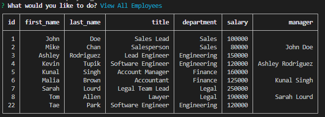

# Employee Tracker

## Task for this Project

Developers frequently have to create interfaces that allow non-developers to easily view and interact with information stored in databases. These interfaces are called **content management systems (CMS)**. Task for this project is to build a command-line application from scratch to manage a company's employee database, using Node.js, Inquirer, and MySQL.


## User Story

```md
AS A business owner
I WANT to be able to view and manage the departments, roles, and employees in my company
SO THAT I can organize and plan my business
```

## Acceptance Criteria

```md
GIVEN a command-line application that accepts user input
WHEN I start the application
THEN I am presented with the following options: view all departments, view all roles, view all employees, add a department, add a role, add an employee, and update an employee role
WHEN I choose to view all departments
THEN I am presented with a formatted table showing department names and department ids
WHEN I choose to view all roles
THEN I am presented with the job title, role id, the department that role belongs to, and the salary for that role
WHEN I choose to view all employees
THEN I am presented with a formatted table showing employee data, including employee ids, first names, last names, job titles, departments, salaries, and managers that the employees report to
WHEN I choose to add a department
THEN I am prompted to enter the name of the department and that department is added to the database
WHEN I choose to add a role
THEN I am prompted to enter the name, salary, and department for the role and that role is added to the database
WHEN I choose to add an employee
THEN I am prompted to enter the employee’s first name, last name, role, and manager, and that employee is added to the database
WHEN I choose to update an employee role
THEN I am prompted to select an employee to update and their new role and this information is updated in the database 
```


## Demonstration & Description

 * [Link to Video Demonstration](https://drive.google.com/file/d/1ifWt6JHaAg1GES4JK9z7bLY5-yklEMwE/view)

 * Main Menu:

 

**NOTE** In video demonstration, console table printer was used to print out tables. (to make it looks cleaner with border & and not printing out null values.) Codes in this repo uses console.table and both of the packages are availalbe to use.

 * console.table:

 

 * console table printer:

 


**Database Schema used for the db tables:** 
* `department`

    * `id`: `INT PRIMARY KEY`

    * `name`: `VARCHAR(30)` to hold department name

* `role`

    * `id`: `INT PRIMARY KEY`

    * `title`: `VARCHAR(30)` to hold role title

    * `salary`: `DECIMAL` to hold role salary

    * `department_id`: `INT` to hold reference to department role belongs to

* `employee`

    * `id`: `INT PRIMARY KEY`

    * `first_name`: `VARCHAR(30)` to hold employee first name

    * `last_name`: `VARCHAR(30)` to hold employee last name

    * `role_id`: `INT` to hold reference to employee role

    * `manager_id`: `INT` to hold reference to another employee that is the manager of the current employee (`null` if the employee has no manager)


## Features

 * View All Employees: view all employees (employee id, first name, last name, role title, department, salary, manager)
 * Add Employee: add new employee
 * Update Employee Role: update employee's role title
 * View All Roles: view all roles (role id, title, department, salary)
 * Add Role: add new role
 * View All Departments: view all departments (department id, department name)
 * Add Departments: add new department
 * Update Employee's Manager
 * View Employees by Manager
 * View Employees by Department
 * Delete Departments, Roles, or Employees
 * View the Total Utilized Budget of Department: combined salaries of all employees in selected department
 * Quit: exit the app

## How to Use

**NOTE** Before invoking the application, user is required to install MySQL server and npm packages.

The application will be invoked by using the following command:

    ```bash
    node index.js
    ```

SQL files should be sourced before invoking application with following example command:

    ```
    source db/schema.sql
    ```

If you are already in db folder, no need to add db directory. Just simply run 'source schema.sql' in MySQL environment. SQL files must be sourced before running index.js files with this order: source schema.sql -> seeds.sql

* When the application is invoked, user is given with several options to manage(view/add/update/delete) employee database. 

* User is required provide inputs for every option. (Either type-in input or selecting choices)

* When deleting Role(s) and/or Department(s), please be aware that employee(s) who are in that role(s) and/or department(s) will be stay remained. Please update their role to existing role. When deleting department(s), make sure to delete the roles in the department.

* To exit the application, select 'Quit'.


## Credits
 * npm [inquirer package](https://www.npmjs.com/package/inquirer/v/8.2.4)
 * npm [mysql2 package](https://www.npmjs.com/package/mysql2)
 * npm [console table printer](https://www.npmjs.com/package/console-table-printer)
 * npm [console.table](https://www.npmjs.com/package/console.table)
 * Function to check if value is only num(digits), referenced from: https://stackoverflow.com/questions/1779013/check-if-string-contains-only-digits

- - -
© 2023 edX Boot Camps LLC. Confidential and Proprietary. All Rights Reserved.
